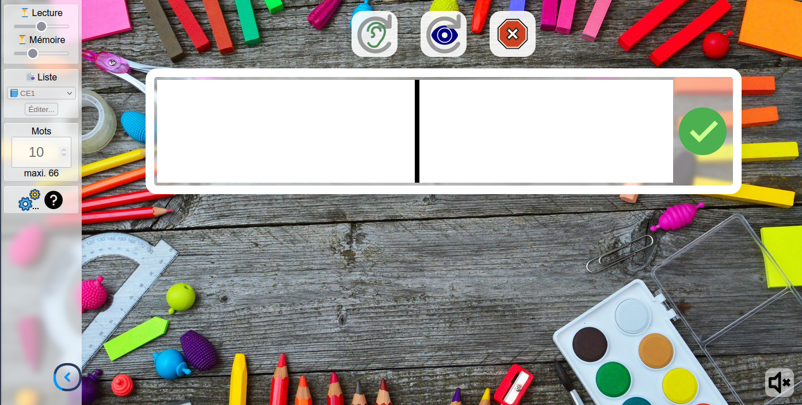

# Flashmots

## Présentation

Flashmots une application dédiée à la mémorisation orthographique.

Un mot est affiché (temps de lecture), puis caché (temps de mémorisation), l'élève doit ensuite l'écrire à l'identique.

Les délais de lecture et de mémorisation sont réglabes via des curseurs. Ils s'adaptent automatiquement à la longueur du mot.

Cinq listes de mots invariables sont proposées par niveaux du CP au CM2, à titre indicatif. Chaque liste est éditable, vous pouvez ainsi ajouter et supprimer des mots.

Une liste dite "personnalisée", vide par défaut, est également disponible.

Il est possible, à partir d'une liste donnée, de créer un lien partageable. En envoyant ce lien à quelqu'un d'autre, il ou elle démarrera Flashmots avec cette liste de mots. Les liens créés n'ont pas de limite de durée, rien n'est stocké sur le serveur, les mots sont contenus dans le lien lui-même.

Avant de commencer un exercice, choisissez le nombre de mots à travailler, dans la limite du contenu de la liste. (Par défaut 10 mots sauf liste personnalisée)

En fin d'exercice, Flashmots affiche un résumé avec les mots travaillés, le nombre d'essais réalisés pour chacun et le nombre de vues demandées.

L'application fonctionne avec un simple navigateur web, elle est donc en principe utilisable sur ordinateur, tablette et téléphone.

Flashmots est développée par Arnaud Champollion, et partagée sous licence libre GNU/GPL. Le code source est déposé sur la forge des Communs Numériques

Pour en savoir plus et télécharger une version hors-ligne, suggérer des améliorations, rapporter des bugs voire participer au développement ... consultez la page du projet Flashmots sur la forge.

## Utilisation

Une instance de démonstration est disponible à l'adresse suivante :
https://educajou.forge.apps.education.fr/flashmots/
Elles est automatiquement mise à jour en fonction des évlolutions du projet.

## Hors-ligne

Pour une utilisation hors, ligne :
- récupérer le ZIP du projet : https://forge.apps.education.fr/educajou/flashmots/-/archive/main/flashmots-main.zip
- extraire le ZIP (clic droit, extraire tout ...)
- dans le dossier Flashmots-main, ouvrir le fichier index.html

## Installation d'une autre instance

Flashmots ne requiert qu'un serveur web, il n'utilise ni PHP ni base de données.
- récupérer le ZIP du projet : https://forge.apps.education.fr/educajou/flashmots/-/archive/main/flashmots-main.zip
- extraire le ZIP (clic droit, extraire tout ...)
- mettre en ligne le dossier (après l'avoir éventuellement renommé) via un transfert FTP.

## Licence

Flashmots est un logiciel libre sous licence GNU/GPL.
